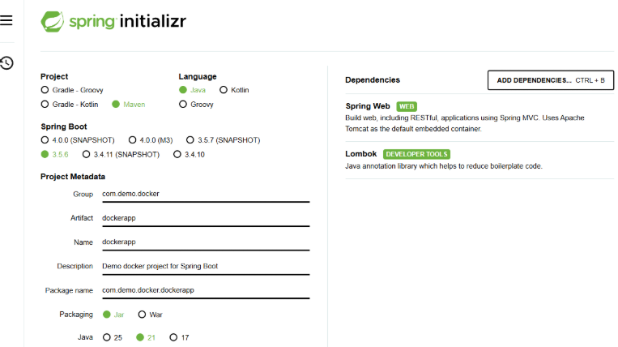
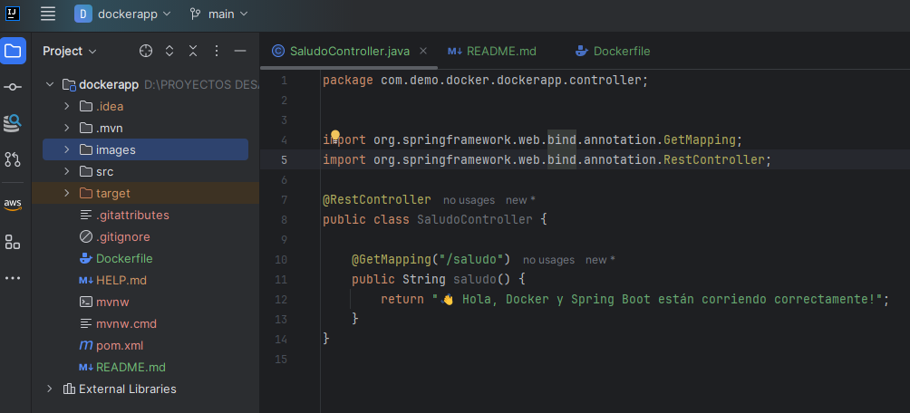
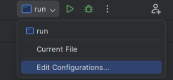
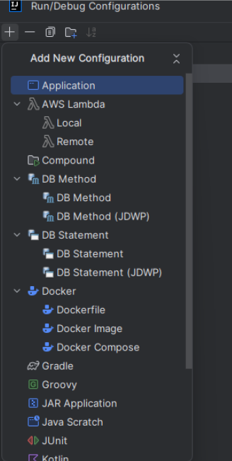
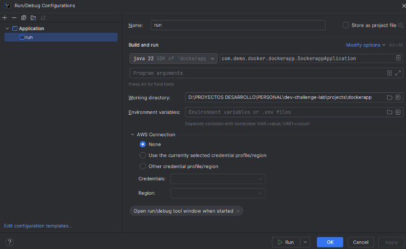
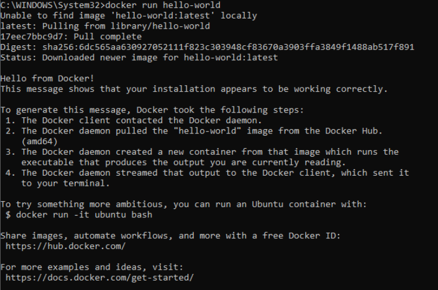
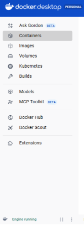
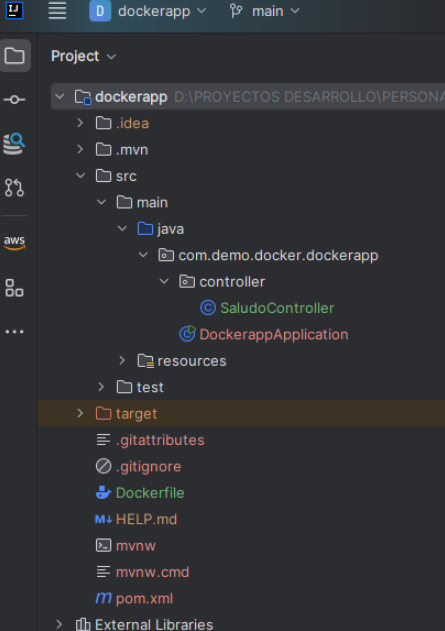
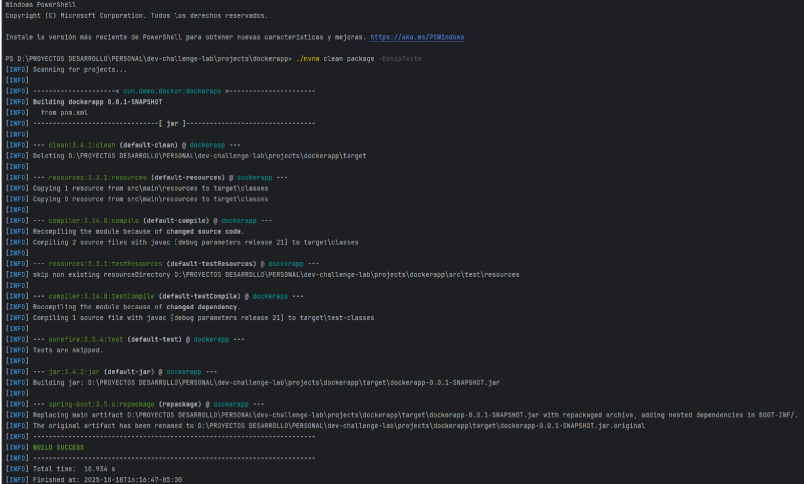

# 🐳 Dockerización de una App Spring Boot

## 🚀 Descripción General
Este manual documenta el proceso completo para **empaquetar y ejecutar una aplicación Java Spring Boot dentro de un contenedor Docker**.  
Incluye desde la creación del proyecto, configuración del `Dockerfile`, hasta la ejecución y resolución de errores comunes.

---
## 🚀 Objetivo
Crear una aplicación básica en Spring Boot que:
Exporte un endpoint REST (por ejemplo: /saludo).


### 1. Se empaquete en un JAR ejecutable.


### 2. Se dockerice usando un Dockerfile sencillo.


### 3. Se ejecute en contenedor.

---

## 🧱 1. Crear el Proyecto Base

Puedes generar el proyecto desde [https://start.spring.io](https://start.spring.io) con las siguientes opciones:

| Propiedad    | Valor             |
|--------------|-------------------|
| Project      | Maven             |
| Language     | Java              |
| Spring Boot  | 3.3.x o superior  |
| Group        | `com.demo.docker` |
| Artifact     | `dockerapp`       |
| Packaging    | Jar               |
| Java         | 22                |
| Dependencies | Spring Web        |
|              | Lombok            |


Una vez descargado el `.zip`, descomprímelo y ábrelo en **IntelliJ IDEA** o **VS Code**.

---

## 🧩 2. Crear un Controlador de Prueba

Ruta:  
`src/main/java/com/demo/docker/dockerapp/controller/SaludoController.java`

```java
package com.demo.docker.dockerapp.controller;

import org.springframework.web.bind.annotation.GetMapping;
import org.springframework.web.bind.annotation.RestController;

@RestController
public class SaludoController {

    @GetMapping("/saludo")
    public String saludo() {
        return "👋 Hola, Docker y Spring Boot están corriendo correctamente!";
    }
}   
```

## ⚙️ 3. Probar la App Localmente

### 3.1 Ejecuta con comandos:
```console
./mvnw spring-boot:run
```
Luego entra a:
👉 http://localhost:8080/saludo

Si ves el mensaje, tu aplicación funciona correctamente de forma local.

### 3.2 Ejecuta desde la opcion run.
Configura el arranque de la aplicación en la opción de Run > Edit configuration




en el la parte superior derecha de Intellij en el simbolo del mas escoges la opcion Application



1. 🏷️ **Cambia el nombre (Name)** del *Run Configuration* para identificar tu proyecto fácilmente.
2. ☕ **Coloca la versión de Java** que vas a utilizar (por ejemplo: `Java 22 SDK`).
3. 🧩 **Selecciona el `SpringApplication` principal** de tu proyecto (la clase con la anotación `@SpringBootApplication`).
4. 💾 **Haz clic en `Apply`** y luego en **`Run`** para iniciar la aplicación.

---

### 🌐 Prueba en tu navegador
👉 Abre tu navegador y visita:  
[http://localhost:8080/saludo](http://localhost:8080/saludo)

---

## 🐳 4. Crear el Dockerfile

### 🧩 4.1 Revisión Inicial

Antes de continuar, asegúrate de que **Docker esté correctamente instalado** en tu sistema operativo:
- 💻 **Windows**
- 🐧 **Linux**
- 🍎 **macOS**

 
#### 🧠 Verificación en Windows

1. Inicia **Docker Desktop**.
2. Espera hasta que aparezca el mensaje:
   > 🟢 *Docker Engine is running*
3. Abre una terminal (PowerShell o CMD) y ejecuta:

```bash
docker run hello-world
```


Si te sale el mensaje de “Hello from Docker!”, ya quedó funcionando 🎉 
y la interfaz te debe aparecer con un mensaje en la parte inferior izquierda como Engine running



---
💡 Siguiente recomendación (si también quieres usar Podman)
Si planeas seguir usando Podman, lo mejor es aislarlo para que no vuelva a interferir:
Apaga Docker antes de usar Podman:
```console
net stop com.docker.service
```
Y al revés, si vas a usar Docker, apaga Podman:
```console
podman machine stop
```
---
#### 4.2 Crear el archivo Dockerfile
Ubícalo en la raíz del proyecto, junto al pom.xml.
Para este caso, usamos la imagen oficial de Eclipse Temurin con Java 22.
```java
# Imagen base con Java 22
FROM eclipse-temurin:22-jdk

# Directorio de trabajo dentro del contenedor
WORKDIR /app

# Copiar el JAR generado al contenedor
COPY target/dockerapp-0.0.1-SNAPSHOT.jar app.jar

# Puerto que expone el contenedor
EXPOSE 8080

# Comando para ejecutar la app
ENTRYPOINT ["java", "-jar", "app.jar"]
```
Para este caso, el archivo queda raiz del proyecto:
`/dockerapp/Dockerfile`                



📦 Importante:
El nombre del .jar debe coincidir exactamente con el generado en target/.
Verifícalo con dir target (Windows) o ls target (Linux/Mac).
---
## 🔨 5. Construir el JAR
Ingresar al terminal donde este el proyecto y ejecutar el siguiente comando como aparece en la imagen, 
el resultado debe ser **BUILD SUCCESS**.
```console
./mvnw clean package
```

El JAR quedará en target/docker-demo-0.0.1-SNAPSHOT.jar
---

## 🧰 6. Compilar el Proyecto

Ejecuta:
```console
./mvnw clean package -DskipTests
```

Esto generará el archivo:

target/dockerapp-0.0.1-SNAPSHOT.jar

## 🧱 6. Construir la Imagen Docker

Desde la raíz del proyecto (donde está el Dockerfile):
```console
docker build -t dockerapp:latest .
```
## ⚠️ IMPORTANTE

Antes de ejecutar el comando `docker build`, asegúrate de que tanto el **`Dockerfile`** como el **`pom.xml`** estén correctamente configurados ✅

### 🔹 En el `Dockerfile`
Verifica que la línea que copia el JAR coincida exactamente con el nombre generado por Maven:

```dockerfile
COPY ../target/dockerapp-0.0.1-SNAPSHOT.jar app.jar
 ```              
ya que dockerapp es el nombre del proyecto y es el nombre que va a buscar con el comando dockerapp:latest
 
✅ Si todo está bien, verás una serie de pasos [+] Building y al final:

Successfully built <IMAGE_ID>
Successfully tagged dockerapp:latest
---
## ▶️ 7. Ejecutar el Contenedor
```console
docker run -d -p 8080:8080 dockerapp
```


-d ejecuta en segundo plano.

-p 8080:8080 mapea el puerto del contenedor al de tu máquina local.

Abre 👉 http://localhost:8080/saludo

Deberías ver:

👋 Hola, Docker y Spring Boot están corriendo correctamente!


---
## 🔍 8. Verificar Contenedores y Logs

Ver contenedores activos:
```console
docker ps
```

Ver logs en tiempo real:
```console
docker logs -f <container_id>
```

Detener el contenedor:
```console
docker stop <container_id>
```

Eliminar contenedor:
```console
docker rm <container_id>
```

Ver imágenes:
```console
docker images
```

## ⚠️ 9. Casos Comunes de Error y Solución
| 🧱 Error | ⚠️ Causa | 🧰 Solución |
|----------|-----------|-------------|
| ❌ `unable to prepare context: ... Dockerfile not found` | El `Dockerfile` no está en la raíz | Mueve el archivo a la carpeta del proyecto (`/dockerapp`) |
| ❌ `No connection could be made because the target machine actively refused it` | Docker Desktop no está encendido | Abre **Docker Desktop** y espera el mensaje *“Docker is running”* |
| ❌ `failed to compute cache key: ... .jar not found` | El nombre del `.jar` en el `Dockerfile` no coincide | Corrige la línea `COPY target/<tu_jar>.jar app.jar` |
| ❌ `Connection refused on localhost:8080` | El contenedor no expone el puerto | Asegúrate de tener `EXPOSE 8080` y `-p 8080:8080` en el comando |
| ❌ `permission denied` | Intentas correr comandos sin permisos | Ejecuta **PowerShell** o **CMD** como *Administrador* |

## 📊 10. Verificar en Docker Desktop


#### Visualización en Docker Desktop

Abre **Docker Desktop → Containers** y verás algo como:

| 🧩 Nombre | 🐳 Imagen | 🔌 Puerto | ⚙️ Estado |
|------------|-----------|-----------|------------|
| `sad_bartik` | `dockerapp` | `8080:8080` | 🟢 **Running** |


### 🧠 Desde la interfaz puedes:

- ⏸️ **Pausar**, 🔁 **Reiniciar** o 🗑️ **Eliminar** el contenedor.
- 🪶 **Ver los logs** o **abrir una consola** dentro del contenedor.
- 📈 **Confirmar el uso de CPU y memoria** en tiempo real.

---


---

## 🐳 Panel principal — Containers

En esta sección de **Docker Desktop** puedes visualizar todos los contenedores que están **en ejecución** o que han sido ejecutados recientemente.  
Cada fila representa un contenedor con su respectiva información y controles.

---

### 🔹 Columnas principales

| 🔖 Columna | 🧩 Descripción |
|-------------|----------------|
| **Name** | Nombre automático o personalizado del contenedor. <br> 👉 Ejemplo:<br> - `sad_bartik`: tu contenedor actual de **dockerapp**.<br> - `hungry_hypatia`: contenedor de prueba usado para `hello-world`. |
| **Container ID** | Identificador único del contenedor (coincide con el mostrado en consola con `docker ps`). |
| **Image** | Muestra la imagen base usada para crear el contenedor.<br> 👉 En tu caso, viene de la imagen personalizada **dockerapp** que construiste. |
| **Port(s)** | Indica los puertos expuestos y mapeados. <br>Ejemplo: `8080:8080` significa que el **puerto 8080 local** se conecta al **8080 del contenedor**, donde corre tu app Spring Boot. <br>🔗 El enlace azul te lleva directo a [http://localhost:8080](http://localhost:8080). |
| **CPU (%) y Memory usage** | Muestra en tiempo real el consumo de recursos del contenedor. <br>💡 En tu caso: **~0.1% CPU y 189 MB RAM** = excelente rendimiento. |

---

## ⚙️ Botones de acción (Actions)

A la derecha de cada contenedor encontrarás los siguientes íconos:

| 🔘 Botón | 🧭 Función |
|----------|------------|
| ▶️ **Play** | Inicia un contenedor detenido. |
| ⏹️ **Stop** | Detiene un contenedor activo. |
| 🗑️ **Trash** | Elimina el contenedor de forma permanente. |
| 🔁 **Restart** | Reinicia el contenedor (útil tras cambios en el código o la imagen). |
| 📦 **Más opciones (⋮)** | Abre opciones avanzadas: ver logs, abrir terminal o inspeccionar detalles. |

---

## 📊 Walkthroughs (Guías interactivas)

En la parte inferior de Docker Desktop encontrarás **tutoriales interactivos** o *walkthroughs* que te ayudan a profundizar:

| 📘 Guía | 💬 Descripción |
|----------|----------------|
| **Multi-container applications** | Enseña cómo usar **Docker Compose** para trabajar con varios contenedores (por ejemplo, tu app + base de datos). |
| **Containerize your application** | Explica paso a paso cómo dockerizar una aplicación — ¡exactamente lo que tú acabas de hacer! 😎 |

---

💡 **Tip Profesional:**  
Puedes hacer clic en el nombre del contenedor (`sad_bartik`) para abrir una vista detallada con pestañas de:
- 🧾 **Logs** → ver la salida del servidor Spring Boot en tiempo real.
- 💻 **Terminal** → ejecutar comandos dentro del contenedor.
- 🧩 **Inspect** → ver la configuración interna y variables de entorno del contenedor.

---

## 📎 Créditos

| 💡 Campo | 📋 Detalle |
|-----------|------------|
| 👤 **Autor** | **Iván David Duque Perdomo** |
| 🧠 **Rol** | Ingeniero de Software / Backend Developer |
| ⚙️ **Tecnologías** | Java 22 · Spring Boot 3.3.x · Docker Desktop |
| 🧾 **Versión del manual** | 1.0.0 |
| 🗓️ **Fecha** | 18 de octubre de 2025 |

---

✨ *Documento elaborado por un desarrollador apasionado por la ingeniería limpia, la automatización y la innovación.* 🚀
