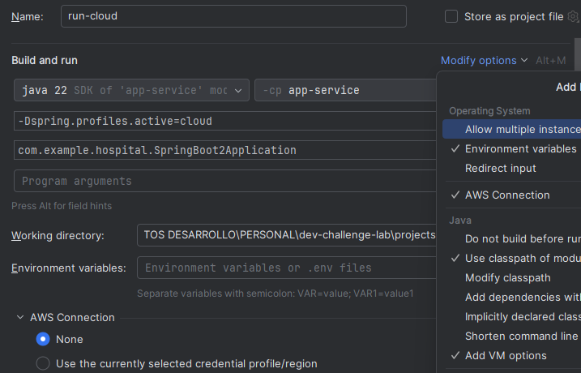
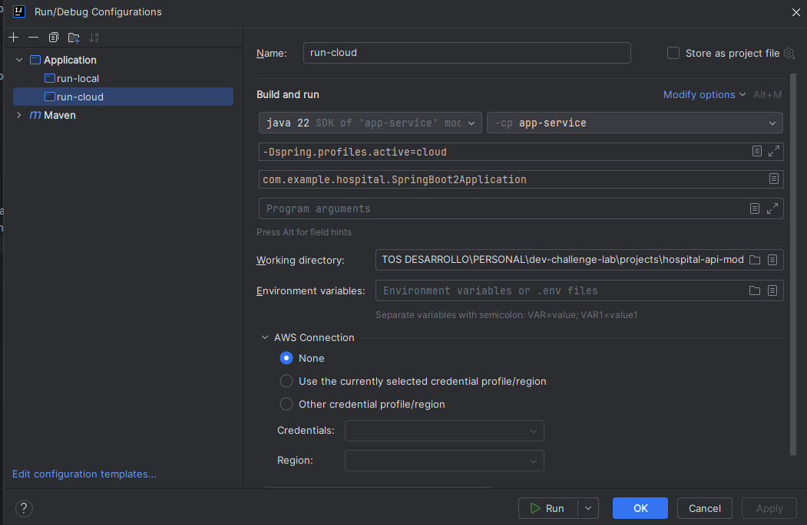
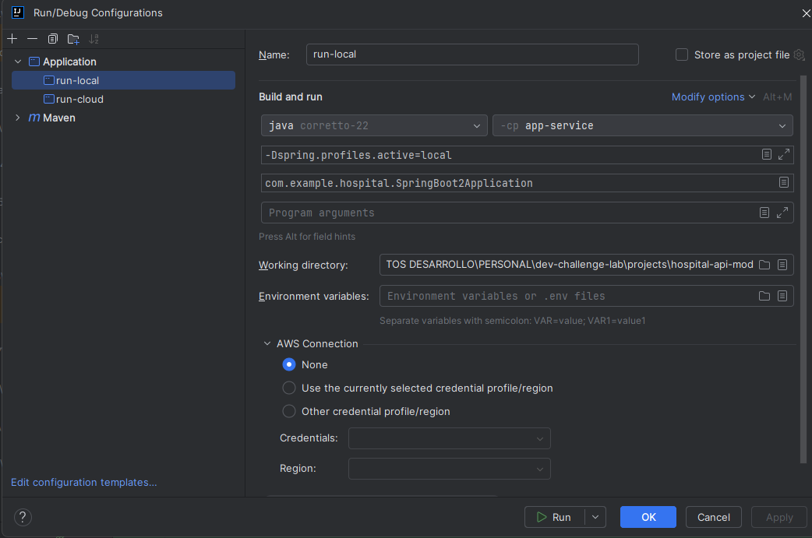

# 🏥 Manual de ejecución - Proyecto `hospital-api`

**Autor:** Iván David Duque Perdomo  
**Lenguaje:** Java 22 (Amazon Corretto 22)  
**Framework:** Spring Boot + GraphQL + MongoDB  
**IDE recomendado:** IntelliJ IDEA

---

## ⚙️ Requisitos previos

Antes de ejecutar el proyecto asegúrate de contar con:

- ☕ Java Corretto 22 instalado y configurado en el PATH.
- 🧰 Maven (usualmente integrado en IntelliJ).
- 🌐 Conexión a internet (si se va a conectar a MongoDB Atlas).
- 🗂️ Archivo `.env` ubicado en la raíz del módulo `app-service`.

---

## 🧾 Configuración del archivo `.env`

Crea el archivo `.env` en la raíz del proyecto con el siguiente contenido:
```env
MONGODB_URI=mongodb+srv://<usuario>:<contraseña>@<cluster>.mongodb.net/hospital?retryWrites=true&w=majority
```
💡 Este archivo define la conexión a la base de datos MongoDB Atlas.  
Si deseas trabajar con una base local, cambia la URL a:

MONGODB_URI=mongodb://localhost:27017/hospital

---

## 🚀 Configuración del perfil de ejecución (Run Configuration)

1. Abre IntelliJ IDEA.
2. Ve a la parte superior y selecciona **Run → Edit Configurations...**
3. Crea una nueva configuración de tipo **Application**:
    - **Name:** hospital-api-local (o hospital-api-cloud)
    - **Main class:** co.com.hospital.SpringbootApplication
    - **Working directory:** raíz del proyecto
    - **Environment variables:** asegúrate de incluir `.env` si tu configuración lo requiere.
    - **Program arguments (opcional):**  
      --spring.profiles.active=local
4. Haz clic en **Modify options → Add VM options** y agrega:



    Para ejecutar en la nube (MongoDB Atlas):
   -Dspring.profiles.active=cloud

   

   Para ejecutar localmente:
   -Dspring.profiles.active=local

   

⚠️ Importante: el campo `VM options` se agrega manualmente desde  
**Modify options → Add VM options**, de lo contrario no aparecerá.


---

## 🧪 Ejecución del microservicio

Una vez configurado el Run:

- Para ambiente Cloud (Atlas):  
  -Dspring.profiles.active=cloud
- Para ambiente Local (MongoDB local):  
  -Dspring.profiles.active=local

Luego ejecuta el microservicio:
Run ▶️ → hospital-api

---

## ✅ Verificación

Una vez iniciado, verifica en la consola alguno de estos mensajes:
```console
Conectado a base en la nube = mongodb+srv://...
o  
Conectado a base local = mongodb://localhost:27017/hospital
```
Luego abre Postman y prueba el endpoint:
POST http://localhost:8080/graphql

---

## 📄 Ejemplo de consulta GraphQL
```graphql
{
"query": "query camillaPorId($id: ID!) { camillaPorId(id: $id) { id estado habitacion fechaInicio fechaFin } }",
"variables": {
"id": "68e84d03c693de24f9824a61"
}
}
```
---

📘 **Notas finales:**
- El proyecto se ejecuta bajo el perfil configurado (`local` o `cloud`).
- El archivo `.env` no debe subirse a GitHub (añadirlo al `.gitignore`).
- Revisa que tu instancia de MongoDB (Atlas o local) esté activa antes de iniciar la aplicación.

---

🧑‍💻 **Hecho por:** Iván David Duque Perdomo  
“Automatiza lo repetitivo, entiende lo esencial.”
